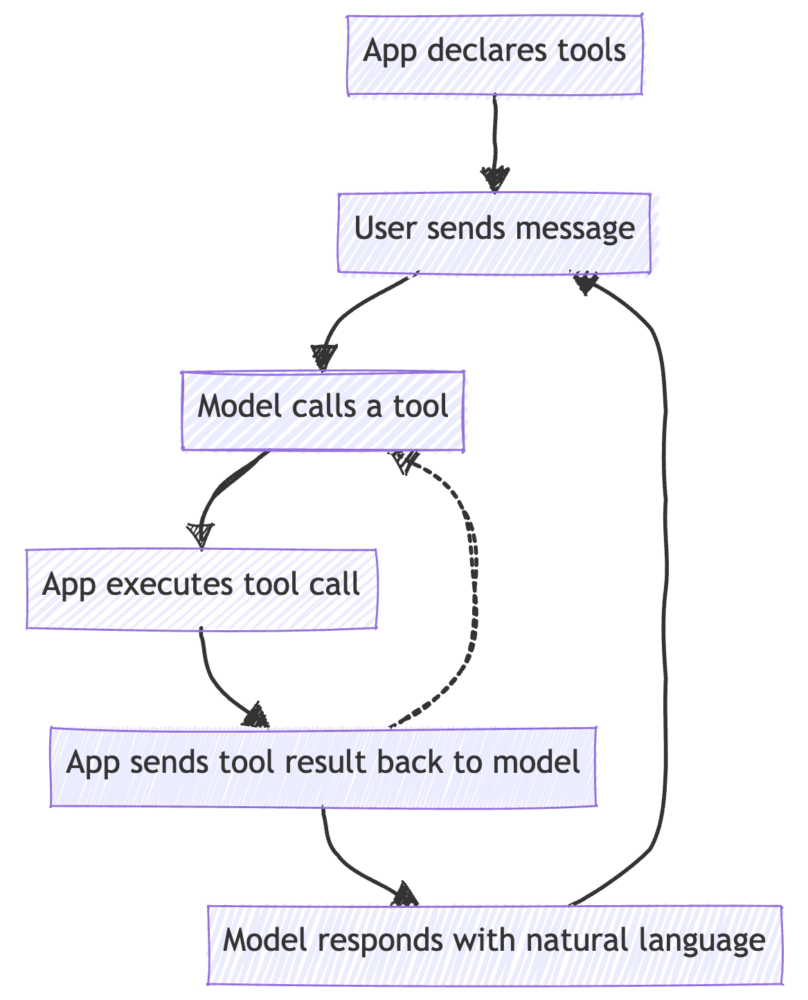
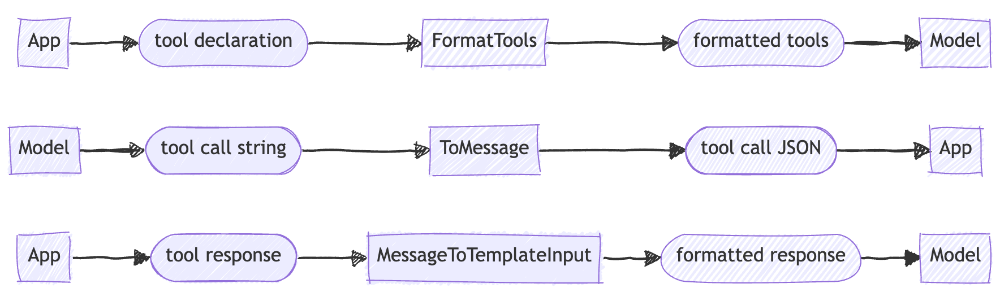

# Tool Use

LiteRT-LM handles tool calling in the [Conversation API](./conversation.md). The Conversation API is
a high-level API that represents a multi-turn conversation with an LLM.

TIP: This page describes how to use tool calling in the C++ Conversation API.
For the Android API, see [LiteRT-LM Android API: Defining and Using
Tools](https://github.com/google-ai-edge/LiteRT-LM/blob/main/android/README.md#6-defining-and-using-tools)

## Concepts

### Tool Calling Flow

Tool calling involves three main entities:

1.  **Application**: The application code written by the developer, using the
    LiteRT-LM library.
2.  **Model**: The LLM that is being called.
3.  **User**: The end-user of the application.

Tool use typically follows these steps:

1.  The application declares the tools that are available to the model. A tool
    declaration consists of a name, parameters, and description. These are
    specified in a JSON object defined by the application.
2.  When the user sends a message to the application, e.g. by typing in a chat
    box, the application sends the message to LiteRT-LM, which feeds the message
    to the model and initiates auto-regressive generation.
3.  The model outputs a string indicating a tool call.
4.  LiteRT-LM detects the tool call and parses the tool call into a JSON object.
5.  The application uses the tool call JSON object to execute the tool call,
    which can perform real-world actions and then return a result. The
    implementation of the tool is provided by the application.
6.  The application sends the tool result back to the model.
7.  The model outputs a natural language response based on the tool result or
    makes another tool call.
8.  Repeat from #2.



  - Application:
      - Provides a specification for each tool, i.e. name, parameters, and
        description.
      - Implements the tools and executes them when requested.
      - Manages the chat loop with the user.
  - LiteRT-LM:
      - Translates human-readable messages into the format the model was trained
        on.
      - Runs inference on the model given a prompt.
      - Detects and parses tool calls.
      - Maintains the conversation history between the user, model, and tools.

## How to Use

### Tool Declarations {#tool-declarations}

When you create a `Conversation` you set a `Preface` object that defines the
initial context for the LLM. This includes the system message and the **tool
declarations**.

To declare the tools available to the model, set the `tools` field of the
`Preface` object to a JSON array of tool declarations. Each tool declaration is
a [JSON schema](https://json-schema.org/learn) containing the tool's name,
description, and parameters.

For example, the following code defines two tools: `get_weather` and
`get_stock_price`:

```c++
constexpr absl::string_view kToolString = R"([
{
  "name": "get_weather",
  "description": "Returns the weather for a given location.",
  "parameters": {
    "type": "object",
    "properties": {
      "location": {
        "type": "string",
        "description": "The location to get the weather for."
      }
    },
    "required": [
      "location"
    ]
  }
},
{
  "name": "get_stock_price",
  "description": "Returns the stock price for a given stock symbol.",
  "parameters": {
    "type": "object",
    "properties": {
      "stock_symbol": {
        "type": "string",
        "description": "The stock symbol to get the price for."
      }
    },
    "required": [
      "stock_symbol"
    ]
  }
}
])";

JsonPreface preface;
preface.tools = nlohmann::ordered_json::parse(kToolString);
```

The `Preface` is passed to `ConversationConfig::Builder` when
you create the `Conversation` object:

```c++
// Set model file path and backend.
std::string model_path = absl::GetFlag(FLAGS_model_path);
ASSIGN_OR_RETURN(ModelAssets model_assets, ModelAssets::Create(model_path));
ASSIGN_OR_RETURN(
  EngineSettings engine_settings,
  EngineSettings::CreateDefault(std::move(model_assets), Backend::CPU));

// Create `Engine`.
ASSIGN_OR_RETURN(
    std::unique_ptr<litert::lm::Engine> engine,
    litert::lm::Engine::CreateEngine(std::move(engine_settings)));

// Create `Conversation`.
auto session_config = litert::lm::SessionConfig::CreateDefault();
ASSIGN_OR_RETURN(auto conversation_config,
                   ConversationConfig::Builder()
                       .SetSessionConfig(session_config)
                       .SetPreface(preface)
                       .Build(*engine));
ASSIGN_OR_RETURN(std::unique_ptr<Conversation> conversation,
                   Conversation::Create(*engine, conversation_config));
```

### Tool Calls

Once tools have been declared, the model may respond to a user message with a
tool call, instead of or in addition to natural language text.

Example:

```c++
// Construct the user message as a JSON object.
JsonMessage user_message = JsonMessage::parse(R"({
  "role": "user",
  "content": {
    "type": "text",
    "text"" "How is the weather in Paris?"
  }
})")

// Send the user message to the model.
ASSIGN_OR_RETURN(Message model_message, conversation->SendMessage(user_message));
```

After the code above runs, `model_message` will contain the following JSON
object:

```json
{
  "tool_calls": [
    {
      "type": "function",
      "function": {
        "name": "get_weather",
        "arguments": {
          "location": "Paris"
        }
      }
    }
  ]
}
```

### Tool Execution

Calling the function is the responsibility of your application. For example,
`get_weather` could call the following function:

```c++
// Returns random weather conditions.
nlohmann::ordered_json GetWeather(const nlohmann::ordered_json& arguments) {
    std::string location = arguments.value("location", "Unknown");
    absl::BitGen gen;
    int temperature = absl::Uniform(gen, 50, 91);
    int humidity = absl::Uniform(gen, 20, 81);
    constexpr std::string weather_conditions[] = {"Sunny", "Cloudy", "Rainy",
                                                  "Windy"};
    std::string condition = weather_conditions[absl::Uniform(
        gen, 0, static_cast<int>(std::size(weather_conditions)))];

  return {
      {"tool_name", "get_weather"},
      {"location", location},
      {"temperature", temperature},
      {"unit", "F"},
      {"humidity", humidity},
      {"condition", condition},
  };
}

// Call the function using the tool call object.
nlohmann::ordered_json arguments = message["tool_calls"][0]["function"]["arguments"];
nlohmann::ordered_json weather_report = GetWeather(arguments);
```

For this code example, let's assume `GetWeather` returns the following JSON
object:

```json
{
  "tool_name": "get_weather",
  "location":"Paris",
  "temperature":72,
  "unit":"F",
  "humidity":50,
  "condition":"Sunny"
}
```

TIP: The [Android
API](https://github.com/google-ai-edge/LiteRT-LM/blob/main/android/README.md#6-defining-and-using-tools)
supports **automatic tool calling**. This allows you to define a class with
annotated methods and LiteRT-LM will automatically call those methods when tool
calls are generated by the model.

### Tool Response

Once your application has called the real-world function, the model needs to
know the result. Pass the tool result as a message with the `role` set to
`tool`:

```c++
// Construct the tool message containing the result.
JsonMessage tool_message = {{"role", "tool"}, {"content", weather_report}};

// Send the tool message to the model.
ASSIGN_OR_RETURN(model_message, conversation->SendMessage(tool_message));
```

After the code above runs, `model_message` will contain the following JSON
object, which includes a natural language interpretation of the tool result:

```json
{
  "content": [
    {
      "type": "text",
      "text": "The weather in Paris is sunny with a temperature of 72°F and humidity of 50%."
    }
  ]
}
```

The application could then display the model's natural language response (*"The
weather in Paris is sunny with a temperature of 72°F and humidity of 50%."*) to
the user.

### Tool Calling Loop

In your application, you will usually want to allow the user to converse with
the LLM in a loop, and to enable the LLM to call tools sequentially before
returning a natural language response to the user.

Create the `Conversation` object by following the instructions in [Tool
Declarations](#tool-declarations).

Next, let's define a class that looks up the tool name and calls the
corresponding function:

```c++
class Tools {
 public:
  Tools() {
    tools_["get_weather"] = absl::bind_front(&Tools::GetWeather, this);
    tools_["get_stock_price"] = absl::bind_front(&Tools::GetStockPrice, this);
  }

  nlohmann::ordered_json CallTool(const std::string& name,
                                  const nlohmann::ordered_json& arguments) {
    auto it = tools_.find(name);
    if (it == tools_.end()) {
      return {{"tool_name", name}, {"error", "Tool not found"}};
    }
    nlohmann::ordered_json tool_response = it->second(arguments);
    return tool_response;
  }

 private:
  // Returns random weather conditions.
  nlohmann::ordered_json GetWeather(const nlohmann::ordered_json& arguments) {
    std::string location = arguments.value("location", "Unknown");
    absl::BitGen gen;
    int temperature = absl::Uniform(gen, 50, 91);
    int humidity = absl::Uniform(gen, 20, 81);
    constexpr std::string weather_conditions[] = {"Sunny", "Cloudy", "Rainy",
                                                  "Windy"};
    std::string condition = weather_conditions[absl::Uniform(
        gen, 0, static_cast<int>(std::size(weather_conditions)))];

    return {
        {"tool_name", "get_weather"}, {"location", location},
        {"temperature", temperature}, {"unit", "F"},
        {"humidity", humidity},       {"condition", condition},
    };
  }

  // Returns a random stock price.
  nlohmann::ordered_json GetStockPrice(
      const nlohmann::ordered_json& arguments) {
    std::string stock_symbol = arguments.value("stock_symbol", "Unknown");
    absl::BitGen gen;
    double price = std::round(absl::Uniform(gen, 100.0, 400.0) * 100.0) / 100.0;
    return {
        {"tool_name", "get_stock_price"},
        {"stock_symbol", stock_symbol},
        {"price", price},
        {"currency", "USD"},
    };
  }

  absl::flat_hash_map<std::string, std::function<nlohmann::ordered_json(
                                       const nlohmann::ordered_json&)>>
      tools_;
};
```

The chat loop will consist of two loops:

  - The outer loop between the *user* and the *model*:
    1.  Takes the user's text input from the terminal.
    2.  Constructs a `message` from the user's text input.
  - The inner loop between the *model* and the *application*:
    1.  Sends the `message` to the model.
    2.  Receives the response from the model.
    3.  Checks the response for tool calls.
    4.  Calls the tools specified in the model's response.
    5.  Constructs a message containing the tool results.
    6.  Loops back to #1.

<!-- end list -->

```c++
// The tools we defined above.
Tools tools;

// This string will hold the next prompt to be sent to the model.
std::string input_prompt;

// Chat loop between user and model.
while (true) {
  // Get input from the user.
  std::cout << "Please enter the prompt (or press Enter to end): "
            << std::flush;
  std::getline(std::cin, input_prompt);

  // Exit if the user pressed Enter.
  if (input_prompt.empty()) {
    break;
  }

  // Construct the user message.
  JsonMessage input_message = {
      {"role", "user"},
      {"content", {{{"type", "text"}, {"text", input_prompt}}}}};

  // Tool calling loop between application and model.
  while (true) {
    // Send the user message to the model.
    ASSIGN_OR_RETURN(Message message,
                      conversation->SendMessage(input_message));

    // Get the JSON message from the model's response.
    if (std::holds_alternative<json>(message)) {
      JsonMessage message_json =
          std::get<nlohmann::ordered_json>(message);

      // Check for tool calls.
      if (message_json.contains("tool_calls") &&
          message_json["tool_calls"].is_array() &&
          !message_json["tool_calls"].empty()) {
        // This JSON array will hold the tool response messages.
        nlohmann::ordered_json tool_messages = nlohmann::ordered_json::array();

        // For each tool call, call the tool and add the response.
        for (const auto& tool_call : message_json["tool_calls"]) {
          JsonMessage tool_message = {{"role", "tool"},
                                                  {"content", {}}};
          const nlohmann::ordered_json& function = tool_call["function"];
          tool_message["content"] =
              tools.CallTool(function["name"], function["arguments"]);
          tool_messages.push_back(tool_message);
        }

        // The next input message is the tool response.
        input_message = tool_messages;
      } else {
        // If there are no tool calls, print the model's response and exit the
        // tool calling loop.
        for (const auto& item : message_json["content"]) {
          if (item.contains("type") && item["type"] == "text") {
            std::cout << item["text"].get<std::string>() << std::endl;
          }
        }

        break;
      }
    }
  }
}
```

The chat loop above will run until the user presses `Enter` at the prompt.

### Tool Calling with `SendMessageAsync`

Tool calling works with `Conversation::SendMessageAsync`.

When you call `SendMessageAsync` to send a message to the model asynchronously:

  - Text chunks are streamed to the callback as usual.
  - When the start of a tool call is encountered, the following happens:
      - LiteRT-LM will wait for the remainder of the tool call to be generated,
      - Parse the full tool call expression
      - Send the parsed tool call JSON to the callback in the `tool_calls` field
        of the message.

To use `SendMessageAsync` in the chat loop example above, you would replace the
inner tool calling loop with the following code:

```c++
// Tool calling loop between application and model in asynchronous mode.
while (true) {
  // This Notification is used to signal when the model is done decoding.
  absl::Notification done;

  // This stores the tool calls.
  nlohmann::ordered_json tool_calls;

  // This is the callback that is called with each message chunk as the model is
  // generating tokens.
  auto user_callback = [&done,
                        &tool_calls](absl::StatusOr<Message> message) {
    if (!message.ok()) {
      // If message is not OK, it means there was an error.
      done.Notify();
      return;
    }

    if (!std::holds_alternative<nlohmann::json>(*message)) {
      return;
    }

    // Get JSON from the message.
    JsonMessage message_json = std::get<JsonMessage>(*message);

    // An empty message indicates the model is done generating.
    if (message_json.is_null()) {
      std::cout << std::endl << std::flush;
      done.Notify();
      return;
    }

    // Print any text content.
    if (message_json.contains("content") &&
        message_json["content"].is_array()) {
      for (const auto& item : message_json["content"]) {
        if (item.contains("text")) {
          std::cout << item["text"] << std::endl << std::flush;
        }
      }
    }

    // Collect any tool calls, if present.
    if (message_json.contains("tool_calls") &&
        message_json["tool_calls"].is_array() &&
        !message_json["tool_calls"].empty()) {
      for (const auto& tool_call : message_json["tool_calls"]) {
        tool_calls.push_back(tool_call);
      }
    }
  };

  // Send message to the model asynchronously.
  RETURN_IF_ERROR(conversation->SendMessageAsync(
      input_message, std::move(user_callback)));

  // Wait for model to finish generating.
  done.WaitForNotification();

  // Handle tool calls.
  for (const auto& tool_call : tool_calls) {
    // Call tools, get results, etc.
    // ...
  }
}
```

## How It Works

Most of the work for tool calling is done in the `ModelDataProcessor`
implementation for the model you're using.

  - Tool declarations are formatted by `ModelDataProcessor::FormatTools`.
  - Tool calls are parsed by `ModelDataProcessor::ToMessage`.
  - Tool calls and responses are formatted in
    `ModelDataProcessor::MessageToTemplateInput`.
      - Additional formatting may be done inside the chat template.


